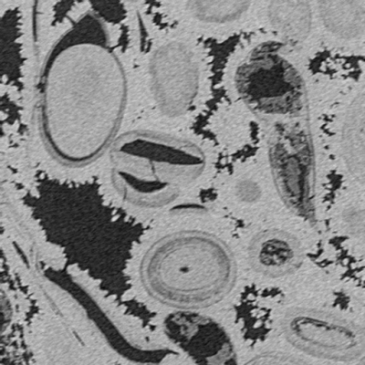
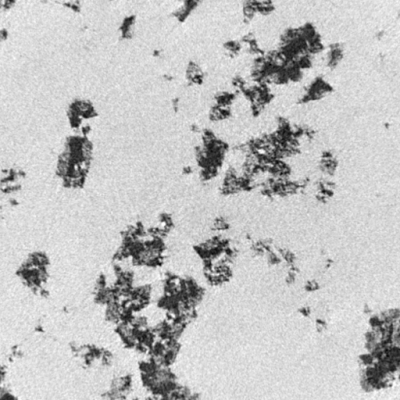
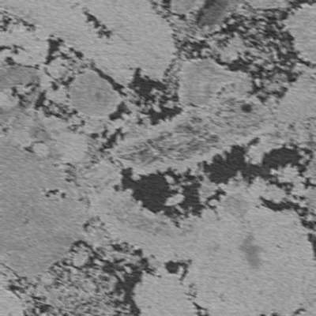
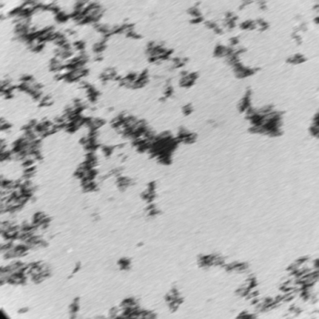
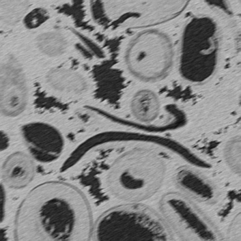
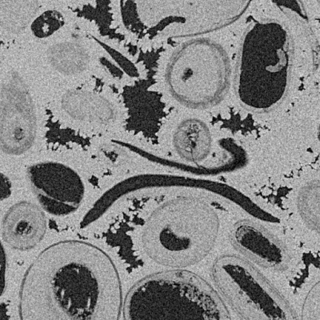
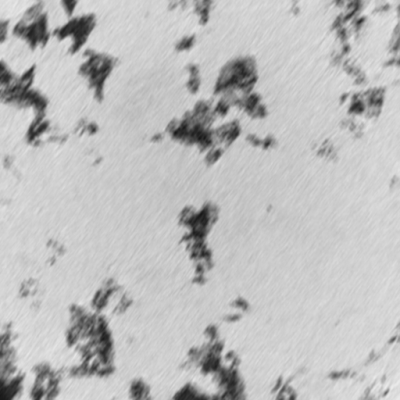
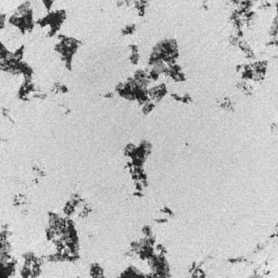
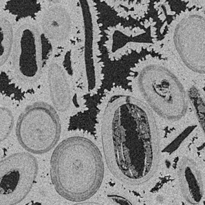

# Research on High-Fidelity Enhancement Technology for Digital Core Images Based on Multi-Scale Modulated Uformer

基于多尺度调制 **Uformer** 的数字岩心图像高保真增强技术研究。本项目针对数字岩心灰度图像的特点，通过引入 LeWin Transformer 块和定制化的单通道处理流程，有效提升了岩心图像的清晰度与孔隙结构辨识度。

---

## 🛠️ 模型介绍 (Architecture)

本项目采用 **UNet** 架构为基础，将传统的卷积层替换为 **Transformer** 块。针对数字岩心数据集（灰度图）进行了以下改进：

1. **输入/输出层优化**：将 `Input Projection` 和 `Output Projection` 的通道数从默认的 3 修改为 **1**，以适配灰度图像。
2. **编码器 (Encoder)**：包含 4 个阶段，每个阶段使用 **局部增强窗口 (LeWin) Transformer** 块，并配合步长为 2 的卷积层进行下采样。
3. **瓶颈层 (Bottleneck)**：堆叠多个 LeWin Transformer 模块进行深层特征提取。
4. **解码器 (Decoder)**：通过步长为 2 的反卷积进行上采样，并使用 `torch.cat` 进行跳跃连接（Skip Connection）特征融合。

---

## ⚖️ 损失函数 (Loss Function)

模型训练采用了对异常值更具鲁棒性的 **Charbonnier Loss**：

$$L(I_1, I_2) = \sqrt{\|I_1 - I_2\|^2 + \epsilon^2}$$

其中 $\epsilon$ 取常数 $1e-3$。

---

## 📂 数据处理与增强 (Data Processing)

### 1. 数据集准备
- **来源**：2000 组碳酸盐岩心灰度图。
- **模糊模拟**：手动生成线性运动模糊核（尺寸 5-10，角度 0-360°）。
- **验证集**：独立选用 400 组图片。

### 2. 预处理与增强
- **读取方式**：针对路径可能包含中文的情况，采用 `np.fromfile` + `cv2.imdecode` 读取。
- **裁剪策略**：由于计算量限制，训练阶段采用 **128×128** 的随机裁剪（Random Crop）。
- **数据增强**：包含上下翻转（Flip）及 90°/180°/270° 旋转。
- **测试预处理**：由于网络要求输入为 128 的倍数，测试图提前 Resize 为 **512×512**。

---

## ⚙️ 训练策略 (Training Strategy)

| 参数项 | 配置 |
| :--- | :--- |
| **优化器** | Adam ($\beta_1=0.9, \beta_2=0.999$) |
| **权重衰减** | 0.02 |
| **学习率调度** | 学习预热 (Warmup) + 余弦退火 (Cosine Annealing) |
| **学习率区间** | 0.000133 → 0.0002 → 0.000001 |
| **训练周期** | 600 Epochs (500 Iterations/Epoch) |

---

## 📊 实验结果 (Experimental Results)

在 200 张独立测试集图片上，使用最佳权重文件 `model_best.pth` 评估结果如下：

### 1. 定量评估指标
| 指标 | 平均值 (Average) |
| :--- | :--- |
| **PSNR (峰值信噪比)** | **26.90** |
| **SSIM (结构相似性)** | **0.87** |

### 2. 可视化评估
模型能有效消除运动模糊，还原清晰的岩心孔隙纹理。

| 输入图片 (Blurry) | 模型输出 (Restored) | 目标图片 (GT) |
| :---: | :---: | :---: |
|  |  |  |
|  |  |  |
|  |  |  |
|  |  |  |
|  |  |  |
|  |  |  |
|  |  |  |

---

## 🗂️ 项目结构说明
- `model.py`: 改进的 Uformer 网络实现
- `losses.py`: Charbonnier Loss 实现
- `clear2blur.py`: 运动模糊核生成逻辑
- `dataset_motiondeblur.py`: 基于 Dataset 类的图像读取与预处理
- `train.py`: 训练引擎入口
- `test_deblur.py`: 测试推理与指标计算

---

## 📚 参考文献
1. Wang Z, et al. "Uformer: A general u-shaped transformer for image restoration." CVPR 2022.
2. Ronneberger O, et al. "U-Net: Convolutional Networks for Biomedical Image Segmentation." MICCAI 2015.
3. Vaswani A, et al. "Attention Is All You Need." NeurIPS 2017.
